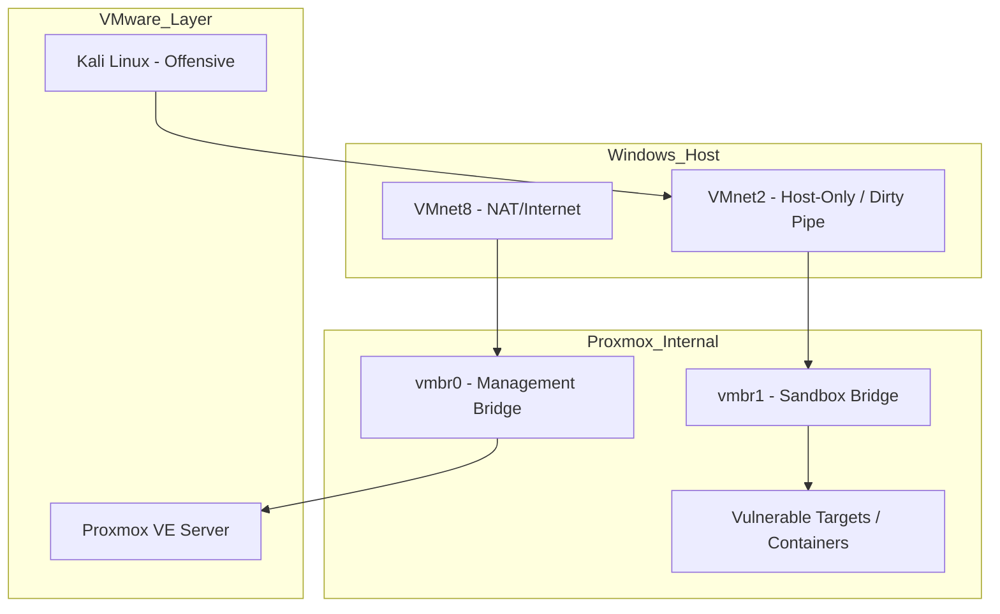

# CyberHomelab: The Interactive Guide
*A comprehensive journey through nested virtualization and security operations.*

---

## 📖 Table of Contents

<h3>🏗️ Module 1: The Foundation</h3>

Build your host infrastructure and deploy your first nested hypervisor.

<a href="/lessons/01-01-introduction-to-nested-virtualization" style="color: var(--vp-c-brand);">Start Module 1 →</a>

<h3>🌐 Module 2: Network Segregation</h3>

Master virtual bridges, firewalls, and isolated sandbox environments.

<a href="/lessons/02-01-proxmox-virtual-bridges-explained" style="color: var(--vp-c-brand);">Start Module 2 →</a>

<h3>🛠️ Module 3: Target Provisioning</h3>

Orchestrate LXC containers, Docker apps, and Windows AD environments.

<a href="/lessons/03-01-linux-containers-lxc-fundamentals" style="color: var(--vp-c-brand);">Start Module 3 →</a>

<h3>⚔️ Module 4: Offensive Operations</h3>

Execute reconnaissance, exploitation, and post-exploitation tactics.

<a href="/lessons/04-01-offensive-methodology-overview" style="color: var(--vp-c-brand);">Start Module 4 →</a>

<h3>🛡️ Module 5: Defensive Security</h3>

Implement SIEM monitoring, traffic analysis, and firewall mitigations.

<a href="/lessons/05-01-defensive-methodology-and-incident-response" style="color: var(--vp-c-brand);">Start Module 5 →</a>

---

## 🛠️ Architectural Overview
The lab utilizes a multi-layer nested virtualization strategy to isolate offensive traffic from the host network.

::: info About the Author
**Ashwani Mishra** is a cybersecurity researcher and educator focused on building accessible training environments. 
[View Author Profile](/author) | [GitHub Profile](https://github.com/ashwyni-mishra) | [Website](https://ashwhwanimishra.me/)
:::

- **Primary Hypervisor**: VMware Workstation Player/Pro (Type-2)
- **Nested Hypervisor**: Proxmox VE (Type-1 Simulation)
- **Offensive Engine**: Kali Linux
- **Defensive Gateway**: pfSense/OPNsense
- **Targets**: Docker-based vulnerable applications (DVWA, Juice Shop) and LXC nodes.

## Network Topology

## Curriculum Structure

### Module 1: Host Infrastructure & Hypervisor Setup
1. [01-01: Introduction to Nested Virtualization](lessons/01-01-introduction-to-nested-virtualization.md)
2. [01-02: Host BIOS and Hardware Acceleration](lessons/01-02-host-bios-and-hardware-acceleration.md)
3. [01-03: Installing VMware Workstation](lessons/01-03-installing-vmware-workstation.md)
4. [01-04: VMware Virtual Network Editor](lessons/01-04-vmware-virtual-network-editor.md)
5. [01-05: Creating the Host-Only Network](lessons/01-05-creating-the-host-only-network.md)
6. [01-06: Introduction to Proxmox VE](lessons/01-06-introduction-to-proxmox-ve.md)
7. [01-07: Deploying Proxmox as a Nested VM](lessons/01-07-deploying-proxmox-as-a-nested-vm.md)
8. [01-08: Proxmox Initial Configuration](lessons/01-08-proxmox-initial-configuration.md)
9. [01-09: Kali Linux Installation on VMware](lessons/01-09-kali-linux-installation-on-vmware.md)
10. [01-10: Attaching Kali to the Host-Only Network](lessons/01-10-attaching-kali-to-the-host-only-network.md)

### Module 2: Network Segregation & Routing
11. [02-01: Proxmox Virtual Bridges Explained](lessons/02-01-proxmox-virtual-bridges-explained.md)
12. [02-02: Configuring vmbr0 Management Interface](lessons/02-02-configuring-vmbr0-management-interface.md)
13. [02-03: Configuring vmbr1 Isolated Sandbox](lessons/02-03-configuring-vmbr1-isolated-sandbox.md)
14. [02-04: Introduction to Virtual Firewalls](lessons/02-04-introduction-to-virtual-firewalls.md)
15. [02-05: Deploying pfSense in Proxmox](lessons/02-05-deploying-pfsense-in-proxmox.md)
16. [02-06: pfSense Interface Assignments](lessons/02-06-pfsense-interface-assignments.md)
17. [02-07: Configuring NAT and Routing in pfSense](lessons/02-07-configuring-nat-and-routing-in-pfsense.md)
18. [02-08: Establishing the DMZ](lessons/02-08-establishing-the-dmz.md)
19. [02-09: Firewall Rules for the Offensive Network](lessons/02-09-firewall-rules-for-the-offensive-network.md)
20. [02-10: Network Connectivity Testing](lessons/02-10-network-connectivity-testing.md)

### Module 3: Target Provisioning & Orchestration
21. [03-01: Linux Containers (LXC) Fundamentals](lessons/03-01-linux-containers-lxc-fundamentals.md)
22. [03-02: Downloading LXC Templates in Proxmox](lessons/03-02-downloading-lxc-templates-in-proxmox.md)
23. [03-03: Deploying an Ubuntu LXC Node](lessons/03-03-deploying-an-ubuntu-lxc-node.md)
24. [03-04: Installing Docker in LXC](lessons/03-04-installing-docker-in-lxc.md)
25. [03-05: Docker Compose Fundamentals](lessons/03-05-docker-compose-fundamentals.md)
26. [03-06: Deploying DVWA via Docker Compose](lessons/03-06-deploying-dvwa-via-docker-compose.md)
27. [03-07: Deploying OWASP Juice Shop](lessons/03-07-deploying-owasp-juice-shop.md)
28. [03-08: Verifying Target Accessibility](lessons/03-08-verifying-target-accessibility.md)
29. [03-09: Creating Windows Server VM Templates](lessons/03-09-creating-windows-server-vm-templates.md)
30. [03-10: Deploying Vulnerable Active Directory](lessons/03-10-deploying-vulnerable-active-directory.md)

### Module 4: Offensive Security Operations
31. [04-01: Offensive Methodology Overview](lessons/04-01-offensive-methodology-overview.md)
32. [04-02: Passive Reconnaissance and OSINT](lessons/04-02-passive-reconnaissance-and-osint.md)
33. [04-03: Active Network Discovery with Nmap](lessons/04-03-active-network-discovery-with-nmap.md)
34. [04-04: Port Scanning and Service Enumeration](lessons/04-04-port-scanning-and-service-enumeration.md)
35. [04-05: Web Application Vulnerability Scanning](lessons/04-05-web-application-vulnerability-scanning.md)
36. [04-06: Intercepting Traffic with Burp Suite](lessons/04-06-intercepting-traffic-with-burp-suite.md)
37. [04-07: Exploiting DVWA Command Injection](lessons/04-07-exploiting-dvwa-command-injection.md)
38. [04-08: Exploiting Juice Shop SQL Injection](lessons/04-08-exploiting-juice-shop-sql-injection.md)
39. [04-09: Using Metasploit for Initial Access](lessons/04-09-using-metasploit-for-initial-access.md)
40. [04-10: Establishing Reverse Shells](lessons/04-10-establishing-reverse-shells.md)

### Module 5: Defensive Security & Monitoring
41. [05-01: Defensive Methodology and Incident Response](lessons/05-01-defensive-methodology-and-incident-response.md)
42. [05-02: Host-Based Logging with Syslog](lessons/05-02-host-based-logging-with-syslog.md)
43. [05-03: Network Traffic Analysis with tcpdump](lessons/05-03-network-traffic-analysis-with-tcpdump.md)
44. [05-04: Analyzing PCAPs with Wireshark](lessons/05-04-analyzing-pcaps-with-wireshark.md)
45. [05-05: Introduction to SIEM Systems](lessons/05-05-introduction-to-siem-systems.md)
46. [05-06: Deploying Wazuh Manager in Proxmox](lessons/05-06-deploying-wazuh-manager-in-proxmox.md)
47. [05-07: Installing Wazuh Agents on Targets](lessons/05-07-installing-wazuh-agents-on-targets.md)
48. [05-08: Detecting Nmap Scans in Wazuh](lessons/05-08-detecting-nmap-scans-in-wazuh.md)
49. [05-09: Detecting Web Attacks in Logs](lessons/05-09-detecting-web-attacks-in-logs.md)
50. [05-10: Implementing Proxmox Firewall Mitigations](lessons/05-10-implementing-proxmox-firewall-mitigations.md)
