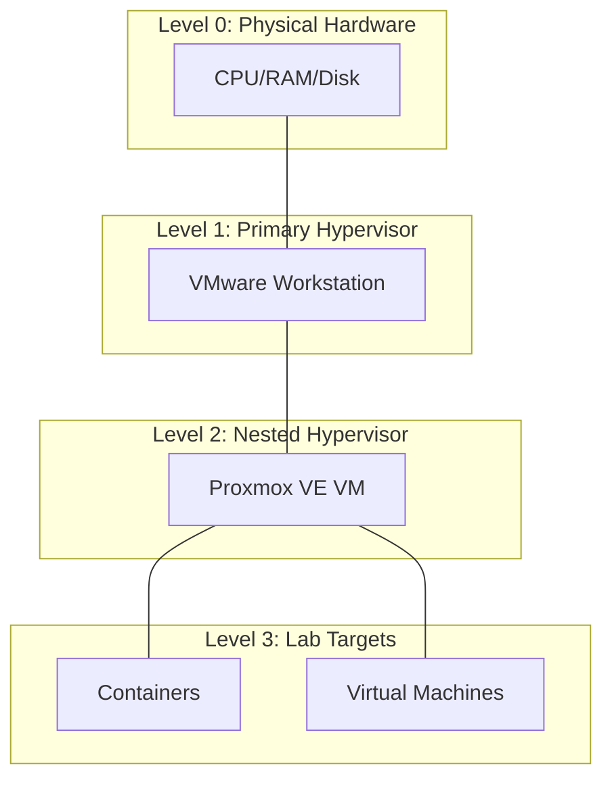

# 01-01: Introduction to Nested Virtualization

## Overview
Nested virtualization refers to the capability of running a hypervisor within another hypervisor. In a standard virtualization environment, a physical host (L0) runs a hypervisor (L1), which in turn hosts virtual machines (L2). With nested virtualization, the L2 virtual machine itself functions as a hypervisor, capable of hosting its own set of virtual machines (L3).

## Use Cases in Security Labs
Nested virtualization is particularly valuable for cybersecurity research and training for several reasons:

1.  **Environment Isolation**: It allows for the creation of complex, multi-layered network topologies within a single physical machine, isolating the lab environment from the primary host system.
2.  **Infrastructure Replication**: Security professionals can replicate entire enterprise infrastructures, including data centers and cloud environments, to test security controls and incident response procedures.
3.  **Hypervisor Security Research**: It provides a safe environment to study hypervisor vulnerabilities and develop escape-detection mechanisms without risking the stability of the physical host.
4.  **Resource Efficiency**: By nesting multiple virtualized layers, researchers can maximize the utilization of a single high-performance host machine.

## Architecture Levels
- **Level 0 (L0)**: The physical hardware (CPU, RAM, Storage).
- **Level 1 (L1)**: The primary hypervisor installed on the physical hardware (e.g., VMware Workstation, ESXi, Proxmox).
- **Level 2 (L2)**: The virtualized hypervisor running as a VM on L1 (e.g., a Proxmox VM inside VMware).
- **Level 3 (L3)**: Virtual machines or containers running inside the L2 hypervisor.

