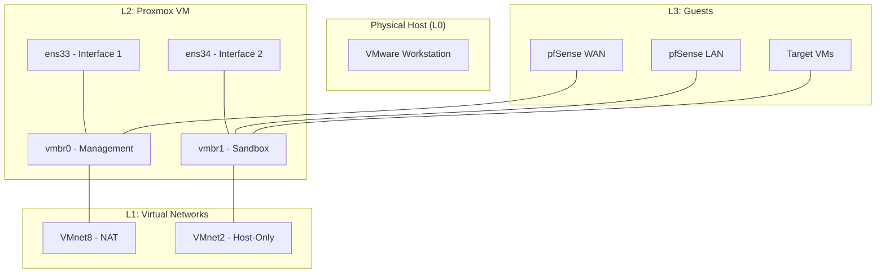

# 02-01: Proxmox Virtual Bridges Explained

## Overview
In Proxmox VE, networking is built around virtual bridges (`vmbr`). A virtual bridge acts like a physical network switch, allowing virtual machines and the host to communicate.

## Core Bridges

### vmbr0: Management Interface
- **Type**: Linux Bridge
- **Purpose**: Provides the primary management connection for the Proxmox host.
- **Connection**: Attached to the physical interface (or virtual adapter in VMware) that connects to the NAT network.
- **Function**: Handles SSH, Web GUI (8006), and outgoing traffic for updates.

### vmbr1: Isolated Sandbox
- **Type**: Linux Bridge
- **Purpose**: Provides the transport layer for the offensive lab traffic.
- **Connection**: Attached to the virtual adapter connected to VMware's VMnet2 (Host-only).
- **Function**: Carries traffic between the attacker (Kali) and the target infrastructure.

## Network Topology Diagram

