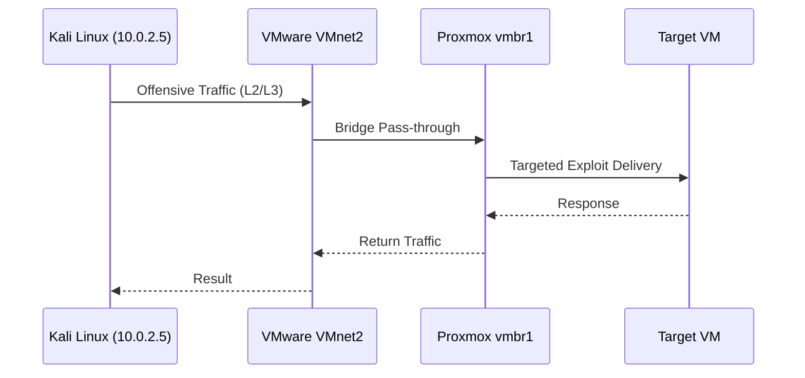

# 02-03: Configuring vmbr1 Isolated Sandbox

## Objective
To establish a second virtual bridge (`vmbr1`) that will facilitate the "dirty pipe" traffic between the offensive engine and the internal target network.

## Configuration Steps

1.  Log in to the Proxmox Web GUI.
2.  Navigate to **System** > **Network**.
3.  Click **Create** > **Linux Bridge**.
4.  Configure the settings:
    - **Name**: `vmbr1`
    - **Bridge ports**: Enter the name of the second network interface (e.g., `ens34`).
    - **IP Address**: Leave **BLANK**. This bridge will operate at Layer 2 for the VMs; IP addressing will be handled by the guest VMs (pfSense/Kali).
    - **Autostart**: Checked.
5.  Click **Create**.
6.  Click **Apply Configuration**.

## Traffic Flow Diagram

## Security Note
By leaving the bridge IP blank on the Proxmox host, we minimize the attack surface of the hypervisor itself within the isolated sandbox. The hypervisor remains "invisible" to the traffic passing through `vmbr1`.
