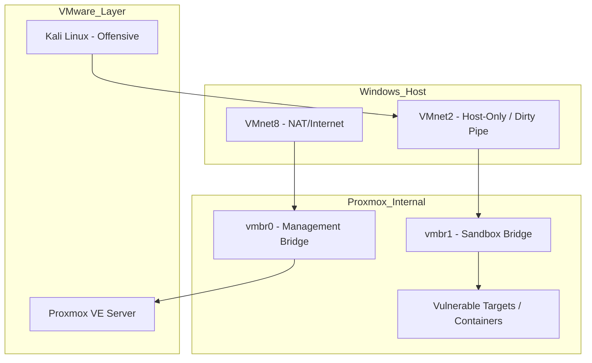

# Project Overview

CyberHomelab is a comprehensive, self-hosted cybersecurity training platform designed to bridge the gap between theoretical security concepts and practical, hands-on experience. Built on a foundation of nested virtualization, this project provides a reproducible and isolated environment where learners can master the entire lifecycle of security operations.

## Project Goals

The primary objective of CyberHomelab is to empower students and professionals to:

- **Understand Infrastructure**: Master the deployment and management of complex virtualized networks using VMware and Proxmox.
- **Practice Offensive Tactics**: Conduct reconnaissance and exploitation in a safe, legal, and isolated environment.
- **Implement Defensive Controls**: Deploy SIEM solutions, configure firewalls, and perform real-time traffic analysis.
- **Simulate Real-World Scenarios**: Experience the interplay between attackers and defenders in a simulated enterprise network.

## Technical Foundation

The lab environment utilizes a multi-layer nested virtualization strategy. This allows for the creation of sophisticated network topologies on a single physical workstation, isolating all offensive traffic within a "Dirty Pipe" network.

### Architectural Highlights

- **Hypervisor Integration**: Seamless coordination between VMware Workstation (Type-2) and Proxmox VE (Nested Type-1).
- **Network Segregation**: Strict isolation of the target infrastructure using virtual bridges and pfSense firewalls.
- **Diverse Target Ecosystem**: A mix of Linux Containers (LXC), Dockerized applications, and Windows Active Directory environments.

---

## Network Topology

The following diagram illustrates the traffic flow and isolation boundaries within the homelab.

::: tip NETWORKING SECURITY
By routing all lab traffic through **VMnet2**, we ensure that exploits and scanning tools never leak into your home network or the public internet.
:::
