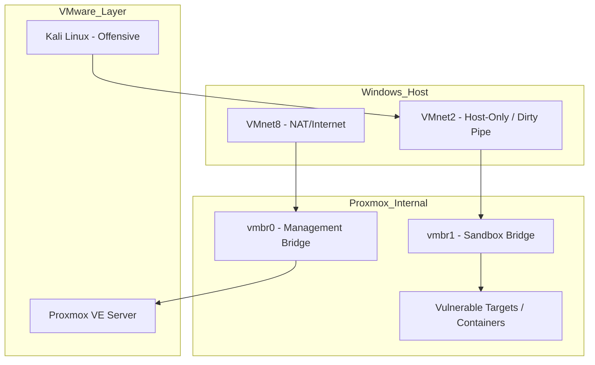

# Technical Overview and Topology

This page provides a deep dive into the underlying architecture of the CyberHomelab environment.

---

## Architectural Overview
The lab utilizes a multi-layer nested virtualization strategy to isolate offensive traffic from the host network.

- **Primary Hypervisor**: VMware Workstation Player/Pro (Type-2)
- **Nested Hypervisor**: Proxmox VE (Type-1 Simulation)
- **Offensive Engine**: Kali Linux
- **Defensive Gateway**: pfSense/OPNsense
- **Targets**: Docker-based vulnerable applications (DVWA, Juice Shop) and LXC nodes.

---

## Network Topology

The following diagram illustrates the traffic flow and isolation boundaries within the homelab.

::: tip NETWORKING NOTE
The use of **VMnet2 (Host-Only)** ensures that offensive traffic from Kali Linux never touches your physical home network or the internet directly.
:::
