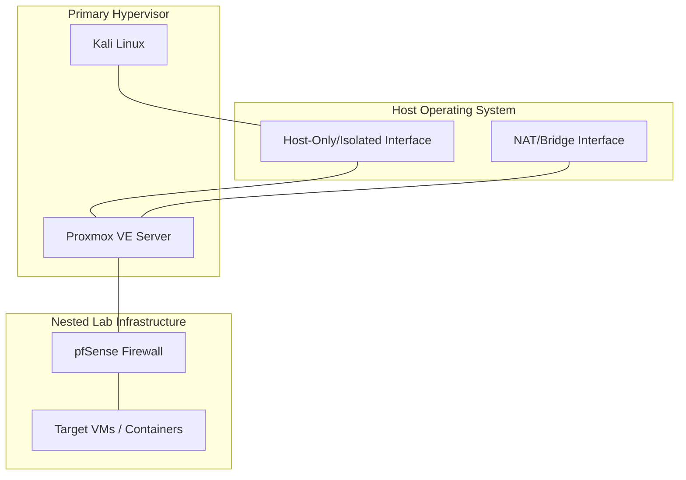

# Project Overview

::: info 🤝 COMMUNITY UPDATES
Developed by **Ashwani Mishra**. Community contributions and refinements are highly valued as this project continues to evolve to meet the growing needs of the security community.
:::

CyberHomelab is a platform-agnostic, comprehensive cybersecurity training framework
 designed to bridge the gap between theoretical security concepts and practical, hands-on experience. This project is engineered to work across all major operating systems and hypervisors, providing a reproducible and isolated environment for mastering security operations.

## Project Goals

The primary objective of CyberHomelab is to empower students and professionals to:

- **Understand Infrastructure**: Master the deployment and management of complex virtualized networks regardless of the underlying platform.
- **Practice Offensive Tactics**: Conduct reconnaissance and exploitation in a safe, legal, and isolated environment.
- **Implement Defensive Controls**: Deploy SIEM solutions, configure firewalls, and perform real-time traffic analysis.
- **Simulate Real-World Scenarios**: Experience the interplay between attackers and defenders in a simulated enterprise network.

## Cross-Platform Technical Foundation

The lab environment utilizes a multi-layer nested virtualization strategy. While specific tools may vary by operating system, the core architectural principles remain constant.

### Supported Platforms

- **Windows**: VMware Workstation, VirtualBox, Hyper-V.
- **macOS**: VMware Fusion, Parallels, UTM (Apple Silicon).
- **Linux**: KVM/QEMU, VMware Workstation, VirtualBox.

### Architectural Highlights

- **Nested Virtualization**: Ability to run a hypervisor within another hypervisor to create multi-tier lab environments.
- **Network Isolation**: Strict segregation of lab traffic using virtual switches and firewalls (pfSense/OPNsense).
- **Heterogeneous Targets**: A mix of Linux Containers, Dockerized applications, and Windows environments.

---

## Required Resources

To build the CyberHomelab, choose the components that match your host operating system:

### 1. Primary Hypervisor (L1)
- **Windows/Linux**: [VMware Workstation](https://www.vmware.com/products/workstation-pro.html) or [VirtualBox](https://www.virtualbox.org/)
- **macOS (Intel)**: [VMware Fusion](https://www.vmware.com/products/fusion.html) or [VirtualBox](https://www.virtualbox.org/)
- **macOS (Apple Silicon)**: [UTM](https://getutm.app/) or [VMware Fusion (Tech Preview)](https://customerconnect.vmware.com/downloads/get-download?downloadGroup=FUS-PUBTP-2023H1)

### 2. Nested Hypervisor (L2)
- **Proxmox VE**: [Download ISO](https://www.proxmox.com/en/downloads) (Recommended for all platforms)

### 3. Core Lab Tools
- **Firewall**: [pfSense](https://www.pfsense.org/download/) or [OPNsense](https://opnsense.org/download/)
- **Attacker OS**: [Kali Linux](https://www.kali.org/get-kali/)
- **SIEM**: [Wazuh](https://wazuh.com/install/)

---

## Network Topology

The following diagram illustrates the logical traffic flow and isolation boundaries. This topology is achievable on any supported hypervisor using virtual bridges/switches.

::: tip ISOLATION GUARANTEE
Regardless of your hypervisor choice, ensure that the "Dirty Pipe" (Isolated Network) is never bridged to your physical LAN to prevent accidental leakage of offensive traffic.
:::
